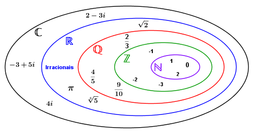

Digitos → 0 al 9

  (0-1-2-3-4-5-6-7-8-9)

## Conjuntos

### Naturales - $\LARGE\mathbb{N}$:

Numeros enteros y positivos (Excluyendo al zero y a los negativos)

$ \mathbb{N}=\{1,2,3,\ldots\infty\} $

### Enteros - $\LARGE\mathbb{Z}$:

Todo numero positivo y negativo entero, incluyendo al zero

$ \mathbb{Z}=\{\texttt{-}\infty\ldots\texttt{-}1,0,1,2,\ldots\infty\} $

### Racionales - $\LARGE\mathbb{Q}$:

Numeros que se pueden expresar como una faracion $a/b$, donde ${a,b}\in\mathbb{Z}$ (A y B son enteros)

Incluye:

- Numeros enteros - $47$
- Fraciones - $12/5$
- Numeros con coma - $47.89$
- Numeros periodicos - $2.\overline{32}$

### Irracionales - $\LARGE\mathbb{I}$:

Numeros que no pueden ser representados como $a/b$

Sus decimales no terminan ni recurren.

$\pi, \sqrt{2}, \sqrt[3]{5} \ldots$

### Reales - $\LARGE\mathbb{R}$:
Todo numero que se puede representar como un punto en la recta numerica

$\mathbb{R}\in\(\texttt{-}\infty,\texttt{+}\infty)$

### Imaginarios

Los numeros imaginarios son numeros complejos que se pueden escribir como la multiplicacion de un numero real y la cifra imaginaria `i`

$i=\sqrt{-1}$

$i^2=-1$

### Primos

Numeros, distintos de 1, que son unicamente divisibles por 1 y por si mismo

$2,3,5,7,11,13,17,19 \ldots$

### Potencias

Los numeros cuadrados son los numeros obtenidos por el cuadrado de un numero.
Se le llama un cuadrado perfecto cuando es el cuadrado de un numero natural.

Esto tambien cumple para los cubos y cuadraticos, en adelante.

## Conjuntos numericos

